# LokeshPusdekar — GitHub Profile

<picture>
  <source media="(prefers-color-scheme: dark)" srcset="./output/dark.svg">
  <source media="(prefers-color-scheme: light)" srcset="./output/light.svg">
  
</picture>

## Backend-focused Developer

Building with **Core & Advanced Java**, **Spring Boot 3**, and **Hibernate 6**.

**Pune, India · Open to Work**

### Stack
- **Languages:** C, C++, Core Java, Advanced Java, DSA, Java EE
- **Frontend:** HTML, CSS, JavaScript, React 18
- **Backend:** Java, Spring Core 6, Spring Boot 3, Hibernate 6
- **Database:** MySQL, PostgreSQL
- **Infrastructure:** Git, GitHub
- **ToolChain:** VS Code, Git, GitHub, Docker, PyCharm

### Connect
- LinkedIn: https://www.linkedin.com/in/lokesh-pusdekar/
- GitHub: https://github.com/LokeshPusdekar
- Email: lokeshpusdekar6@gmail.com
