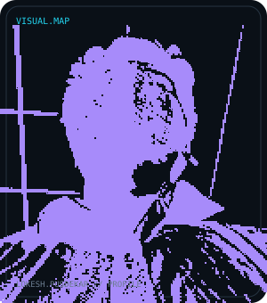
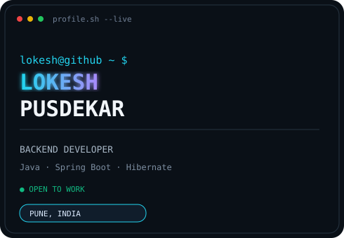
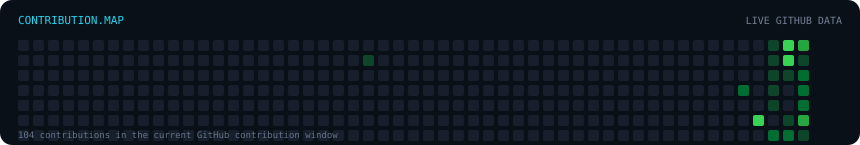

<h3><code>lokesh@github ~ $ whoami</code></h3>

<table>
<tr>
<td valign="top">

</td>
<td valign="top">

</td>
</tr>
</table>

 

<h3><code>lokesh@github ~ $ ./system.sh</code></h3>

<b>Backend-focused Developer · Java · Spring Boot · Hibernate</b> 
Building clean backend systems, learning continuously, and shipping practical software.

<table>
<tr>
<td><b>Location</b></td><td>Pune, India</td>
<td><b>Education</b></td><td>Bachelor's in Information Technology</td>
</tr>
<tr>
<td><b>Status</b></td><td>🟢 Open to Work</td>
<td><b>Focus</b></td><td>Backend Engineering</td>
</tr>
</table>

 

<h3><code>lokesh@github ~ $ ./stack.sh</code></h3>

  

<h3><code>lokesh@github ~ $ ./contributions.sh</code></h3>

  

<h3><code>lokesh@github ~ $ ./stats.sh</code></h3>

  

  

<h3><code>lokesh@github ~ $ ./activity.sh</code></h3>

  

<h3><code>lokesh@github ~ $ ./snake.sh</code></h3>

<picture>
  <source media="(prefers-color-scheme: dark)" srcset="https://raw.githubusercontent.com/LokeshPusdekar/LokeshPusdekar/output/github-snake-dark.svg">
  <source media="(prefers-color-scheme: light)" srcset="https://raw.githubusercontent.com/LokeshPusdekar/LokeshPusdekar/output/github-snake.svg">
  
</picture>

  

<h3><code>lokesh@github ~ $ ./links.sh</code></h3>

&nbsp;&nbsp;
&nbsp;&nbsp;

  

<code>profile.sh --status: online</code> · <code>built with Java, Spring Boot & curiosity</code>

